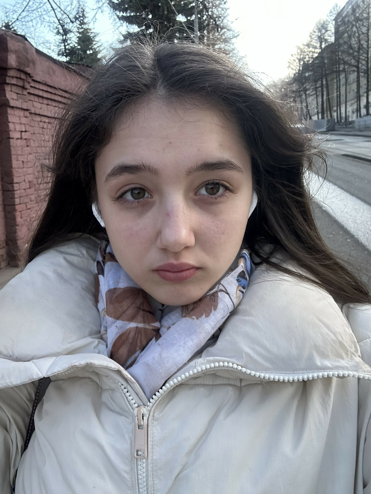
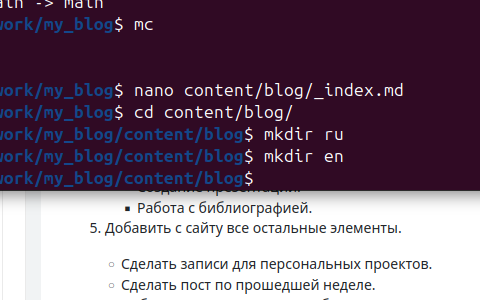
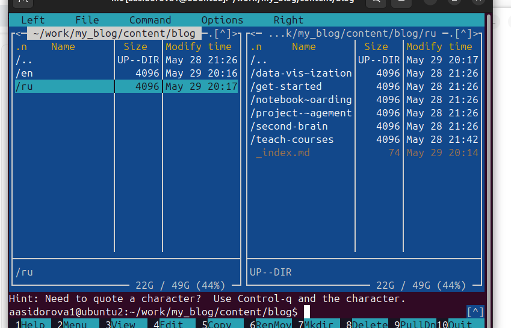
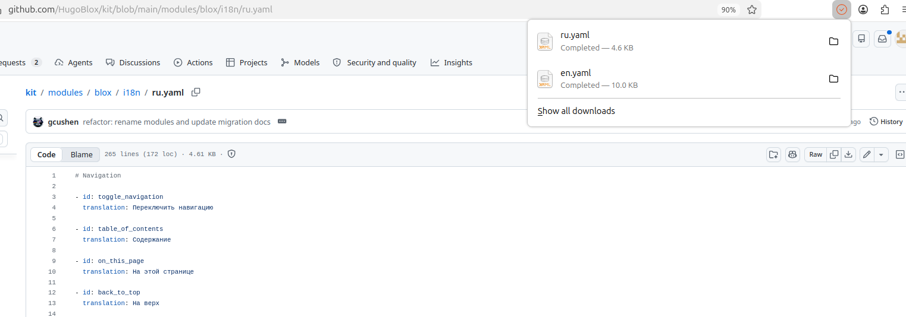
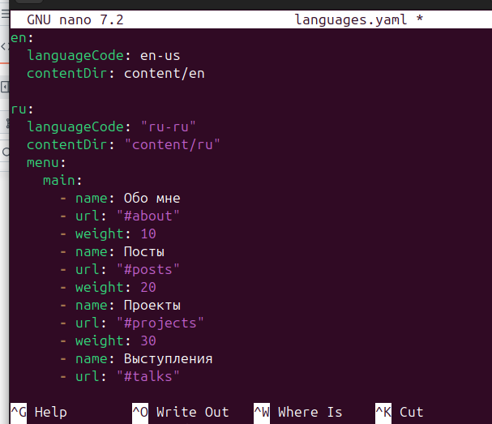
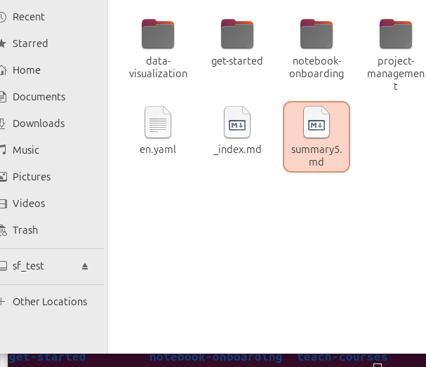
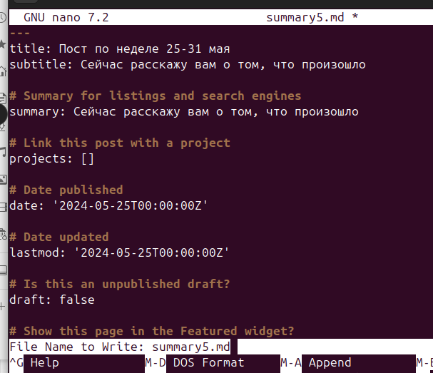
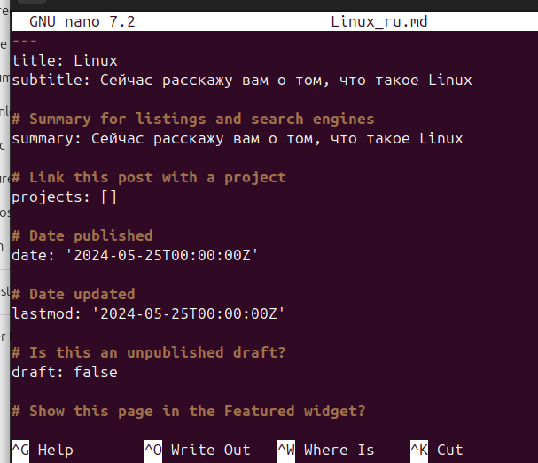
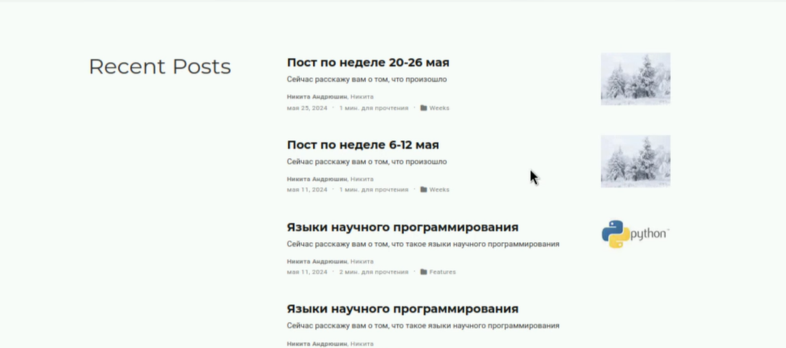

---
## Author
author:
  name: Сидорова Александра Андреевна
  email: 1032256488@rudn.ru
  affiliation:
    - name: Российский университет дружбы народов
      country: Российская Федерация
      postal-code: 117198
      city: Москва
      address: ул. Миклухо-Маклая, д. 6
## Title
title: Презентация по 6 этапу индивидуального проекта
subtitle: НБИбд-01-25
date: today
---

# Докладчик

:::::::::::::: {.columns align=center}
::: {.column width="70%"}

  * Сидорова Александра Андреевна
  * студентка 1 курс
  * НБИбд-01-25
  * Российский университет дружбы народов им. П. Лумумбы
  * 1032256488@rudn.ru

:::
::: {.column width="30%"}

:::
::::::::::::::

# Цель работы

Размещение двуязычного сайта на Github.

# Задание

Размещение двуязычного сайта на Github.

    - Сделать поддержку английского и русского языков.
    - Разместить элементы сайта на обоих языках.
    - Разместить контент на обоих языках.
    - Сделать пост по прошедшей неделе.
    - Добавить пост на тему по выбору (на двух языках).

# Выполнение лабораторной работы

1. Создаю в папке content/blog две новые пустые папки en и ru. После чего копирую все данные из папки blog и создаю две версии документов, одну для русской другую для английской. 

2. Я перехожу в репозиторий HugoBlox на github в раздел modeles и скачиваю оттуда два файла для изменения языков английчкий и русский вариант. 

3. После чего перехожу в папку config/_default открываю и правлю файл languages.yaml 

4. После чего в папке blog/content создаю файл summary5 в него пишу пост за 25-31 мая, позже создаю каталог с таким же именем.

5. Создаю в папке blog новый каталог Linux для создания одноименной статьи. 

6. Проверяю на своем сайте, что эти статьи получились 

# Заключение 

Я приобрела практические навыки в создании статей и переводе их на другие языки
